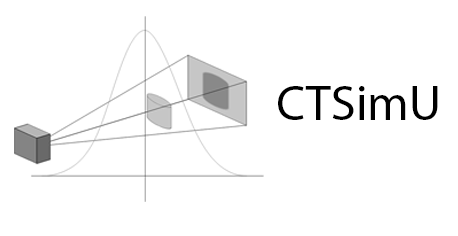

CTSimU Scenario Descriptions |release|
======================================

.. figure:: pictures/fileformat_logo.*
    :figwidth: 15%
    :align: right

This is the specification for a JSON-based file format to handle the parameters of a full industrial CT scan scenario, intended for describing virtual CT scenarios for simulations, as well as for documenting real CT scan geometries and acquisition parameters and their measurement uncertainties.

| Specification version |release|, released under the **Apache 2.0 license.**
| A |link-pre|\ |release|\ |link-post| of this specification is available.

**Example scenarios** and simulated projection images can be found on the specification's `Github repository <https://github.com/BAMresearch/ctsimu-scenarios>`__.

.. |link-pre| raw:: html

    <a href="ctsimu-scenarios_

.. |link-post| raw:: html

    .pdf"><b>PDF document</b></a>

**About this work**

This work was funded through the project `CTSimU <https://www.ctsimu.forschung.fau.de/>`__ (*Radiographic Computed Tomography Simulation for Measurement Uncertainty Evaluation*, WIPANO project 03TNH026A).

`WIPANO <https://www.innovation-beratung-foerderung.de/INNO/Navigation/DE/WIPANO/wipano.html>`__ projects are financed by the German `Federal Ministry for Economic Affairs and Energy <https://www.bmwi.de/>`__ and managed by `Project Management Jülich <https://www.ptj.de/>`__.

.. toctree::
   :maxdepth: 2

   introduction
   general
   file
   environment
   geometry
   detector
   source
   samples
   acquisition
   materials
   proprietary
   fullexample
   metadata
   changes
   bibliography